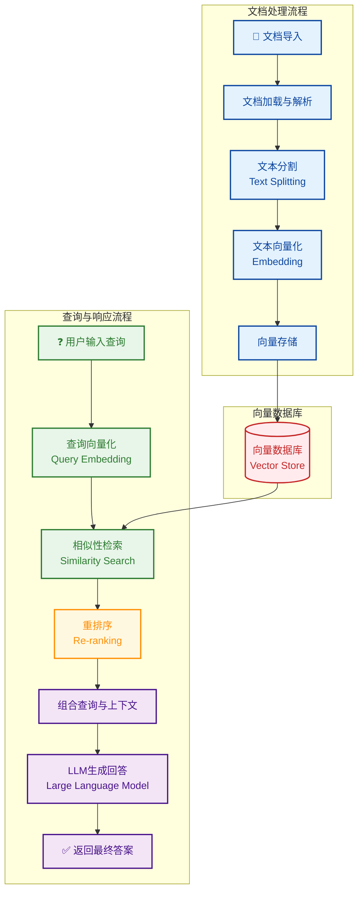

# RAG 知识库系统

一个基于 FastAPI + WebSocket + ChromaDB 的智能检索增强生成（RAG）知识库系统，支持文档上传、智能搜索和对话式问答。

<p align="center">
  <!-- GitHub 不会渲染视频标签，显示图片作为替代 -->
  
</p>

<p align="center">
  <!-- 保留视频标签给其他平台使用 -->
  <video width="800" controls style="display:none;">
    <source src="https://anthonybuer182.github.io/ai-chat-rag/RAG.mp4" type="video/mp4">
    您的浏览器不支持视频播放。
  </video>
</p>

> **注意**: GitHub README 不支持直接显示视频。请使用以下方式观看完整演示：
> 
> - [📺 点击这里直接观看视频](https://anthonybuer182.github.io/ai-chat-rag/RAG.mp4)
> - 或者下载项目后本地查看 `docs/RAG.mp4` 文件
> - 上图是系统界面的静态截图

## 🌟 功能特性

### 📚 文档管理
- **多格式支持**: 支持 TXT, MD, HTML 等格式
- **智能分块**: 自动将文档分割成语义完整的文本块
- **向量存储**: 使用 ChromaDB 存储文档向量嵌入
- **重复检测**: 防止重复上传相同文档
- **文档预览**: 在线查看文档内容
- **搜索功能**: 关键词搜索文档内容

### 💬 智能对话
- **WebSocket 实时通信**: 提供流畅的对话体验
- **多文档选择**: 可选择多个文档作为知识来源
- **上下文感知**: 基于上传的文档内容进行智能回答
- **流式响应**: 实时显示AI生成内容
- **Markdown 渲染**: 支持富文本格式显示

### 🔍 高级检索
- **向量召回**: 结合嵌入相似度和语义检索
- **重排优化**: 使用交叉编码器提升结果相关性
- **中文优化**: 针对中文内容优化的嵌入模型

## 🛠️ 技术栈

### 后端
- **FastAPI**: 高性能 Python Web 框架
- **WebSocket**: 实时双向通信
- **ChromaDB**: 向量数据库
- **Sentence Transformers**: 文本嵌入模型
- **Cross Encoder**: 重排模型
- **SQLite**: 文档元数据存储

### 前端
- **HTML5 + CSS3**: 现代化响应式界面
- **JavaScript ES6+**: 交互逻辑
- **WebSocket API**: 实时通信
- **Marked.js**: Markdown 渲染
- **Font Awesome**: 图标库

### AI 集成
- **DeepSeek API**: 大语言模型服务
- **中文优化模型**: shibing624/text2vec-base-chinese
- **重排模型**: cross-encoder/mmarco-mMiniLMv2-L12-H384-v1

## 📦 安装部署

### 环境要求
- Python 3.8+
- pip 20.0+

### 1. 克隆项目
```bash
git clone https://github.com/Anthonybuer182/ai-chat-rag.git
cd ai-chat-rag
```

### 2. 安装依赖
```bash
pip install -r requirements.txt
```

### 3. 配置环境变量
创建 `.env` 文件并设置 DeepSeek API 密钥：
```bash
DEEPSEEK_API_KEY=your_deepseek_api_key_here
```

> **注意**: 项目使用 DeepSeek API，需要注册并获取 API 密钥
> 
> **获取 API 密钥**: 访问 [DeepSeek 平台](https://platform.deepseek.com/) 注册账号并获取 API 密钥

### 4. 启动应用
```bash
python main.py
```

应用将在 `http://0.0.0.0:8000` 启动，访问该地址即可使用。

### 5. API 文档
访问 `http://0.0.0.0:8000/docs` 查看完整的 API 文档。

## 🚀 使用指南

### 上传文档
1. 点击"文档管理"标签页
2. 拖拽文件到上传区域或点击"选择文件"
3. 系统自动处理文档并构建向量索引

### 智能对话
1. 点击"智能聊天"标签页  
2. 选择要参考的文档（可选）
3. 输入问题并发送
4. AI 将基于所选文档内容回答

### 文档搜索
1. 在文档管理页面点击搜索图标
2. 输入关键词搜索文档内容
3. 查看相关度排序的搜索结果

## 📁 项目结构

### 目录结构
```
ai-chat-rag/
├── main.py                 # 主应用文件
├── requirements.txt        # 依赖包列表
├── text_chunk.py          # 文本分块处理
├── app.log                # 应用日志
├── .gitignore            # Git 忽略文件
├── data/                 # 数据存储目录
│   ├── chroma/          # ChromaDB 数据
│   └── knowledge_base.db # SQLite 数据库
├── static/              # 静态文件目录
│   └── uploads/         # 上传文件存储
├── templates/           # 模板文件
│   └── index.html       # 前端页面
└── utils/               # 工具模块
    ├── __init__.py
    └── stream_llm.py    # LLM 流式处理
```
### 知识库架构图


## 🔧 配置说明

### 模型配置
- **嵌入模型**: `shibing624/text2vec-base-chinese` (中文优化)
- **重排模型**: `cross-encoder/mmarco-mMiniLMv2-L12-H384-v1`
- **LLM 模型**: `deepseek-chat` (通过 DeepSeek API)

### 文本分块参数
- **块大小**: 150 字符
- **重叠大小**: 30 字符
- **分隔符**: 段落 > 句子 > 单词 > 字符

### 检索参数
- **召回数量**: 10 条
- **重排数量**: 5 条
- **相似度阈值**: 动态计算

## 🛠️ 开发指南

### 添加新功能
1. 在 `main.py` 中添加新的 API 端点
2. 在前端 `templates/index.html` 中添加相应界面
3. 更新文档和测试

### 自定义模型
修改 `main.py` 中的模型配置：
```python
# 更换嵌入模型
embedding_model = SentenceTransformer('your-model-name')

# 更换重排模型  
reranker = CrossEncoder('your-reranker-model')

# 更换 LLM 服务
async def stream_llm(messages):
    # 实现自定义 LLM 调用
```

## 📊 性能优化

### 内存优化
- 使用流式处理减少内存占用
- 分块处理大型文档
- 异步处理提高并发性能

### 响应速度
- 预加载嵌入模型
- 使用持久化向量数据库
- WebSocket 实时通信

## 🔒 安全考虑

- 文件类型验证
- 大小限制检查
- SQL 注入防护
- XSS 攻击防护
- CORS 配置

## 🤝 贡献指南

1. Fork 项目
2. 创建特性分支 (`git checkout -b feature/AmazingFeature`)
3. 提交更改 (`git commit -m 'Add some AmazingFeature'`)
4. 推送到分支 (`git push origin feature/AmazingFeature`)
5. 开启 Pull Request

## 📄 许可证

本项目基于 MIT 许可证 - 查看 [LICENSE](LICENSE) 文件了解详情

## 🙏 致谢

- [FastAPI](https://fastapi.tiangolo.com/) - 优秀的 Python Web 框架
- [ChromaDB](https://www.trychroma.com/) - 轻量级向量数据库
- [Sentence Transformers](https://www.sbert.net/) - 文本嵌入模型
- [DeepSeek](https://platform.deepseek.com/) - 大语言模型服务
- [Font Awesome](https://fontawesome.com/) - 图标库

## 📞 支持

如有问题或建议，请通过以下方式联系：

- 提交 [Issue](https://github.com/Anthonybuer182/ai-chat-rag/issues)

## 🎯 路线图

- [ ] 支持多语言界面
- [ ] 支持更多文件格式解析
- [ ] 集成更多 LLM 提供商
- [ ] 支持自主配置模型参数


---

**注意**: 使用前请确保已配置正确的 API 密钥，并遵守相关服务的使用条款。
